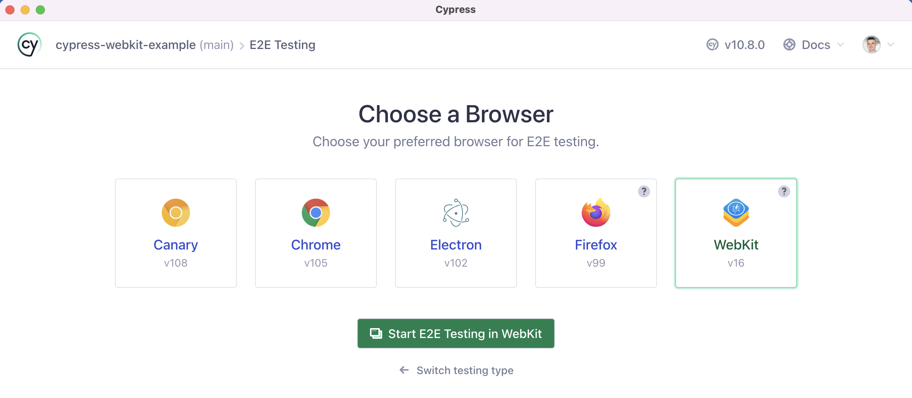

# cypress-webkit-example  

> Run Cypress tests using WebKit browser

Read the blog post [Run Cypress Tests Using WebKit Browser](https://glebbahmutov.com/blog/cypress-webkit/)

- Cypress announcement [Cypress 10.8: Experimental: Run tests in WebKit](https://www.cypress.io/blog/2022/09/13/cypress-10-8-experimental-run-tests-in-webkit/)
- Cypress documentation about [launching browsers](https://on.cypress.io/launching-browsers)

## Small print

Author: Gleb Bahmutov &lt;gleb.bahmutov@gmail.com&gt; &copy; 2022

- [@bahmutov](https://twitter.com/bahmutov)
- [glebbahmutov.com](https://glebbahmutov.com)
- [blog](https://glebbahmutov.com/blog)
- [videos](https://www.youtube.com/glebbahmutov)
- [presentations](https://slides.com/bahmutov)
- [cypress.tips](https://cypress.tips)
- [Cypress Tips & Tricks Newsletter](https://cypresstips.substack.com/)
- [my Cypress courses](https://cypress.tips/courses)

License: MIT - do anything with the code, but don't blame me if it does not work.
